# Bitcoin in Online Payments: Moving towards digital currency for digital payments

The present repository contains all source code related to the thesis submitted in partial fulfilment of the requirements for the degree of Master of Informatics, Specialisation Area of Software Engineering at ISEP (Instituto Superior de Engenharia do Porto).

The context of this thesis lies in the exploration activity of an emerging technological area. Its main objective is the development of a prototype capable of supporting the cryptocurrency Bitcoin. Thus, the following activities are planned:

- Analyse the suitability of different cryptocurrency payment gateways and decision criteria that should be considered when selecting a cryptocurrency payment gateway.
- Design and implement a prototype integrating with multiple cryptocurrency payment gateways.
- Validate the solution in terms of some quality attributes.  

## Solution Requirements

The main objective of this thesis is the development of a prototype capable of supporting the cryptocurrency Bitcoin, integrating multiple cryptocurrency payment gateways where the most adequate is chosen to process the transaction. The cryptocurrency payment gateway is chosen accordingly to a decision’s criteria.

The goals of this thesis are defined to help merchants integrate Bitcoin cryptocurrency payment into their e-commerce websites. Therefore, the main actors of this solution are the merchants themselves, which mainly interact with the system and perform the functional operations.

The UML Use Case Diagram identifies the functional requirements through the definition of use cases of the system.

|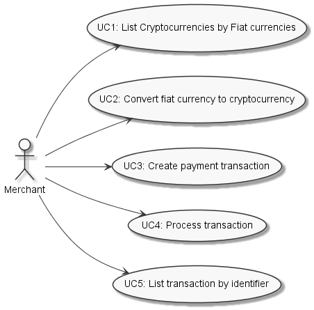|
|:--:|
|*System functional requirements*|

Following table describes each identified use case.

|Use Case Identification| Description |
|:--|:--|
| UC1 | The authenticated and authorised merchant lists the cryptocurrencies that can be converted from a fiat currency. |
|UC2 | The authenticated and authorised merchant converts a fiat currency to a cryptocurrency.
|UC3 | The authenticated and authorised merchant initiates a cryptocurrency payment transaction.
|UC4 | The authenticated and authorised merchant process the payment of a previously created transaction.
|UC5 | The authenticated and authorised merchant lists all transactions.|

Following table describes the requirements in terms of some quality attributes (Maintainability,
Security, Reliability, Traceability, and Interchangeability)

|Identification | Quality Attribute | Description
|:--|:--|:--|
| QA1 |  Maintainability 	| The technical debt ratio of the system should be less than 5%; There should not be more than 30 code smells; The system must be well documented.
| QA2 |  Security 			| The system must not have any vulnerability; The system must not have dependencies with vulnerabilities; The system needs to protect details of transactions and customers from internal and external fraud/criminal usage; The system must use the HTTPS protocol for datatransmissions.
| QA3 |  Reliability 		| The system must not have any bugs ensured by an external service; The system is expected to be available 99.99% of the time.
| QA4 |  Traceability 		| The system should trace the transactions and communications.
| QA5 |  Interchangeability | The system should be able to be changed without the need to change the merchant website; The system should be able to have different configurations and endpoints of communication

The solution should obey some constraints regarding its design and implementation, enumerated in the following table.

| Identification | Description
|:--|:--|
| CON1 | Adoption of open-source technologies.
| CON2 | The system must be accessible from a variety of platforms.
| CON3 | The communications between components must be secure.
| CON4 | The system should integrate with cryptocurrency payment gateways that allow the settlement in at least three fiat currencies.

Additionally, following table identifies some concerns to consider.

| Identification | Description
|:--|:--|
| CRN1 | Activity log.
| CRN2 | Documentation.
| CRN3 | Authentication.
| CRN4 | Authorisation.
| CRN5 | Continuous integration  

## Solution Analysis

The UML Class Diagram in the following figure presents the domain model to enhance the comprehension of the system domain and concepts that impact the business. It represents the classes of domains and their cardinalities.

|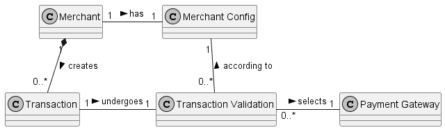|
|:--:|
|*Domain model diagram*|

- The concept Merchant represents the entity Merchant that will use the system. It can convert the fiat currency to a cryptocurrency, initiate a transaction and list the transactions.
- Transaction is the entity that represents a financial transaction of cryptocurrencies, which in this case is a payment.
- Payment Gateway is the representative entity of the cryptocurrency payment gateway, and it aggregates some information related to it.
- The concept Merchant Config represents the entity that represents the Merchant configuration.
- Transaction Validation is the entity that intends to represent the validation of the transaction and the decision of the proper cryptocurrency payment gateway to process it.

### Decision Criteria

The chosen cryptocurrency payment gateways differentiate essentially on the list of cryptocurrencies supported during payment. For this reason, the decision criterion will be the supported cryptocurrencies for payment.

CoinPayments is the cryptocurrency payment gateway that supports more cryptocurrencies, then BitPay, COINQVEST and finally Coinbase Commerce.

One can consider an ordered list of cryptocurrency payment gateways that support a specific cryptocurrency. In this regard, the application avoids dependency on only one cryptocurrency payment gateway. In case of one cryptocurrency payment gateway is not available, others can be available to perform the transaction. It will help with the reliability (QA3) of the application.

The application should assess the following to obtain an ordered list of cryptocurrency payment gateways:
1. If CoinPayments supports the transaction's cryptocurrency, then this cryptocurrency payment gateway is considered.
2. If BitPay supports the transaction's cryptocurrency, then it is taken into consideration.
3. If COINQVEST supports the transaction's cryptocurrency, then this cryptocurrency payment gateway is considered.
4. If Coinbase Commerce supports the transaction's cryptocurrency, then this cryptocurrency payment gateway is considered.

The UML Activity Diagram in following figure illustrates this flow.

|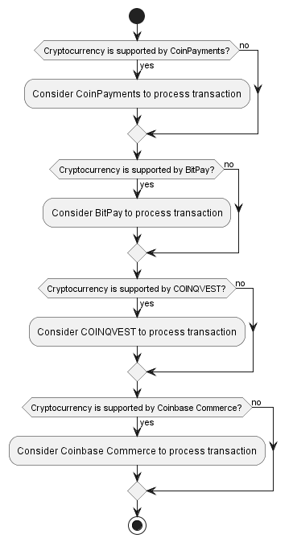|
|:--:|
|*Decision regarding the cryptocurrencies payment gateway which will process the transaction*|

## Solution Design

The UML Component Diagram in following figure represents the components that composite the system proposed with segregation of responsibilities. It also illustrates how they interact with each other.

|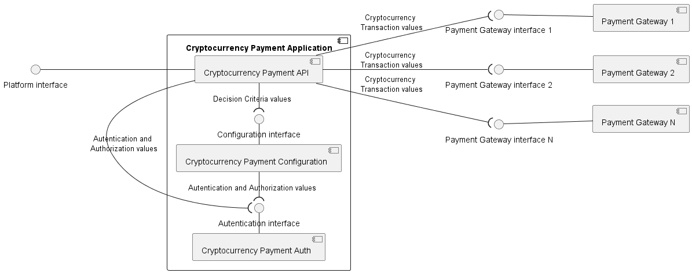|
|:--:|
|*High-level design of the system with segregation of responsibilities, presented in a UML Component Diagram*|

The analysis of figure allows one to conclude the existence of different components:

- Cryptocurrency Payment API is the component that has the responsibility to process and list cryptocurrency transactions. Thereby, it communicates with the components of the cryptocurrency payment gateways, Cryptocurrency Payment Configuration and Cryptocurrency Payment Auth. It provides an interface that can be consumed by the merchants’ services and user interfaces (UIs).
- Cryptocurrency Payment Configuration is the component responsible to manage the decision of the cryptocurrency payment gateway that will process a transaction. It consumes the interface provided by the component Authentication/Authorization API.
- The component Cryptocurrency Payment Auth is responsible for the authentication and authorization of the merchant.
- The components Payment Gateway 1, Payment Gateway 1 and Payment Gateway N represent the cryptocurrency payment gateways that will be integrated into the solution.

In this way, the segregation of responsibilities relies upon the existence of different API abstracting and distributing, therefore, the domain logic.

### Detailed Design

Following figure demonstrates the components and their relations that constitute the Cryptocurrency Payment API. It represents a logical view presented in a UML Component Diagram.

|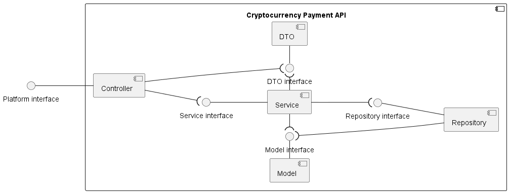|
|:--:|
|*Logical View of component Cryptocurrency Payment API*|

The following components are possible to be specified:
- Controller is the entry point of the REST API and has the responsibility to receive and send HTTP requests and responses, respectively. This component is a gateway between the HTTP information and the domain logic.
- Service is responsible for handling the business logic and provides an abstraction to the persistence layer. They are in control of mapping the DTO to domain classes and vice versa. In this way, controllers do not have knowledge about domain classes and, consequently, access to business logic.
- Model is an object that represents some information about the business domain. Manage system data and associated operations.
- DTO represents objects that only contain the information needed by the presentation layer. In this way, irrelevant information and business logic are not exposed.
- Repository is responsible for accessing the database and applying database operations. It contributes to the isolation of the data access layer from the business layer.

Following figure exemplifies a process view aiming to represent the relations between the system’s components. The UML Sequence Diagram illustrates the functional interaction of UC1, UC2, UC3 and UC4.

|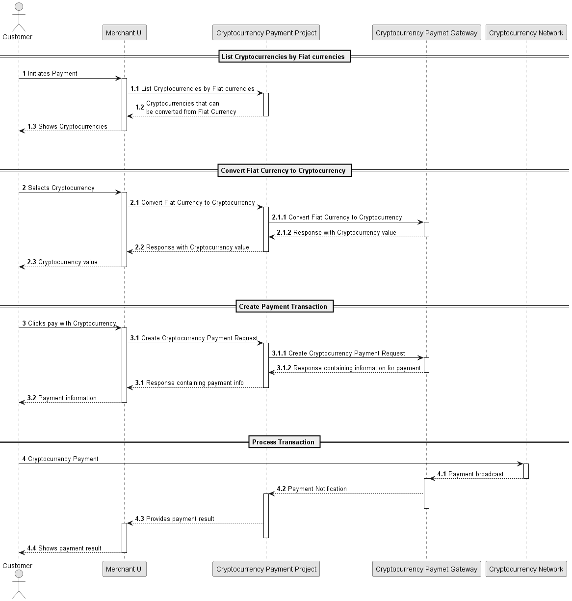|
|:--:|
|*Process view of use cases UC1, UC2, UC3 and UC4*|

The customer starts the payment process by interacting with the Merchant’s UI and consequently calls the Cryptocurrency Payment Application to list the cryptocurrencies that can be converted from the fiat currency. The Cryptocurrency Payment Application will authenticate and authorize the merchant and return the list of cryptocurrencies to the Merchant’s UI. So the customer can select the preferred cryptocurrency.

Once the client chooses the cryptocurrency, the Merchant’s UI will call the Cryptocurrency Payment Application to convert the fiat currency to the cryptocurrency. The Cryptocurrency Application will authenticate and authorize the merchant, identify the cryptocurrency payment gateway that should be used in the transaction and call it to obtain the converted cryptocurrency.

After the converted cryptocurrency, the customer can then pay with the preferred cryptocurrency. The Cryptocurrency Payment Application is called to create the payment transaction, which will once again authenticate and authorize the merchant, identify the cryptocurrency payment gateway, and call it to create the payment transaction. The system will return to the Merchant’s UI the payment information (such as wallet address and/or QR Code), so the customer can proceed with the transfer of the chosen cryptocurrency.

Once the customer transfers the cryptocurrency, the network of the cryptocurrency receives the transaction and broadcasts the payment to the cryptocurrency payment gateway. It will notify the Cryptocurrency Payment Application, which should handle the request respectably. The result of the payment will be shown to the customer.

Following figure represents the aggregates of the Cryptocurrency Payment Application, which can be treated as a single unit. There are two aggregates with the entities Merchant and Transaction as their aggregate roots. In this case, the aggregate Transaction has a reference to the aggregate root Merchant to identify the financial transaction initiator, and it is composed of value objects that contain more information about it.

|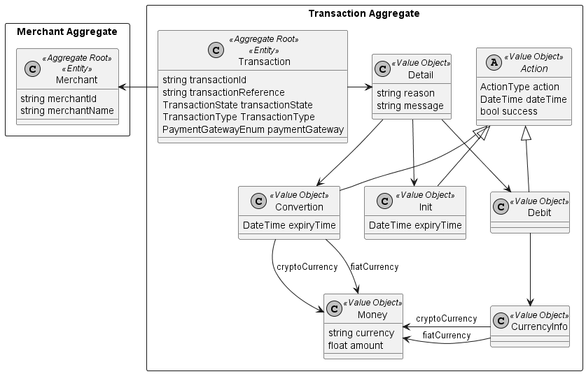|
|:--:|
|*UML Class Diagram for Transaction Aggregate*|

## Solution Implementation

### Authentication and Authorization
As referred on all use cases and CRN3 and CRN4, only an authenticated and authorized merchant can access the services provided by the Cryptocurrency Payment Application. An application responsible for such functionalities was created to separate the responsibilitiess, as described in section [Solution Design](#Solution-Design).

The Basic access authentication was implemented, which means that in each HTTP request, the merchant must specify their username and password. In Basic HTTP authentication, the Authorization header passes to the API a Base64 encoded string representing the username and password joined by a single colon ∶ appended to the text Basic as follows:

	𝐵𝑎𝑠𝑖𝑐 < 𝐵𝑎𝑠𝑒64(𝑢𝑠𝑒𝑟𝑛𝑎𝑚𝑒: 𝑝𝑎𝑠𝑠𝑤𝑜𝑟𝑑) >

In the CryptocurrencyPaymentAPI was created a handler (which extends the class 	`Microsoft.AspNetCore.Authentication.AuthenticationHandler`) responsible to	communicate with the component CryptocurrencyPaymentAuth. It sends a request with the Authorization header to know if the merchant is authenticated and authorized.

### Exception Handling
A global handler middleware was created to catch all exceptions thrown by the application in one place. It removes the need for duplicate code for exception handling throughout the application. Moreover, it disables the possibility of returning to the client information about the source code.

The IException is an interface which contains the specification of the information (status code and error message) that should be available to provide to the end-users. This interface was created to minimize the changes required when creating a custom application exception, therefore applying the Open-Closed Principle. This principle helps guarantee modifiability and, consequently, the application's maintainability (QA1).

The error of type `IException` returns its status code and error message, and all other exceptions yield the 500 Internal Server Error response. The following classes implement this interface:

- `NotAuthorizedException`, which is specific to the authentication/authorization process, returns 401 Unauthorized responses.
- An error of type `ValidationException` is specific to the request validation process and returns 400 Bad Request responses.
- An error of the type `ServiceUnavailableException` is specific to the communication process with the external services that the application depends on and returns 503 Service Unavailable responses.

This information is illustrated in the UML Class Diagram in following figure.

|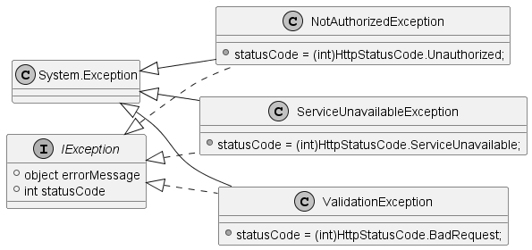|
|:--:|
|*Interface IException and its implementation classes, presented in a UML Class Diagram*|

### Transaction Status

From UML Sequence Diagram presented in section [Detailed Design](#Detailed-Design), one can see that a financial transaction goes through different processes and, consequently, states. The UML State Diagram in following figure shows the events and financial transaction states.

|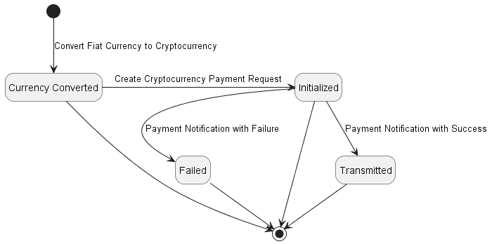|
|:--:|
|*Transaction Status*|

When converting fiat currency to cryptocurrency (UC2), the financial transaction is in the "Currency Converted" state. Next, the transaction can only go to the "Initialized" state when the transaction creation request is received (UC3). Finally, the transaction is processed (UC4), where notification may be successful, thus moving to the "Transmitted" state, or unsuccessful, being the "Failed" state.

###  Functional Requirements
As mentioned in Section [Detailed Design](#Detailed-Design), the Controller layer depends on the Service layer, which in turn depends on the Repository layer. Forthe layers classes and methods to not all be tightly coupled because of direct instantiation, the Dependency Inversion principle was applied.

In that manner, interfaces were created for all services and repositories, which are initiated by the known process of Dependency Injection. In this design pattern, the classes are given other objects that they depend on and the class itself codes against an interface rather than a specific implementation class.

The following sections explain how the different use cases were implemented and introduce some more architectural and design patterns.

#### UC1: List Cryptocurrencies by Fiat currencies

This use case intends to list the cryptocurrencies that can be converted from a fiat currency, as described in section [Requirements](#Requirements). Since this information is handled by the application CryptocurrencyPaymentConfiguration, the CryptocurrencyPaymentAPI makes it an HTTP request to obtain it. The list is then returned to the merchant.

#### UC2: Convert fiat currency to cryptocurrency
The choice of payment gateway is made in this use case. Consequently, this is where the
decision criteria presented in section [Decision Criteria](#Decision-Criteria) apply.

After authentication and authorization of the merchant and validation of the request, an HTTP request is made to CryptocurrencyPaymentConfiguration to get the ordered list of payment gateways that can process the transaction in the specified currencies. As introduced in section [Decision Criteria](#Decision-Criteria) was decided to get a list of possible payment gateways instead of just one for cases where the services are unavailable. The next step is to validate the availability of the payment gateway services with a Ping request.

For the creation of the payment gateway service class was used the creational design pattern, Factory. An interface (`ICryptoGatewayFactory`), with the list of the creation methods and its concrete class (`CryptoGatewayFactory`) were created. An interface (`ICryptoGatewayService`) for each payment gateway service and its concrete classes were also created. The maintainability (QA1) and Interchangeability (QA5) are benefited from this approach since it facilitates the integration with more cryptocurrency payment gateways without the need to change the existing source code.

The UML Class Diagram in following figure provides a visual view of these interfaces, classes and other services created to implement this use case.

|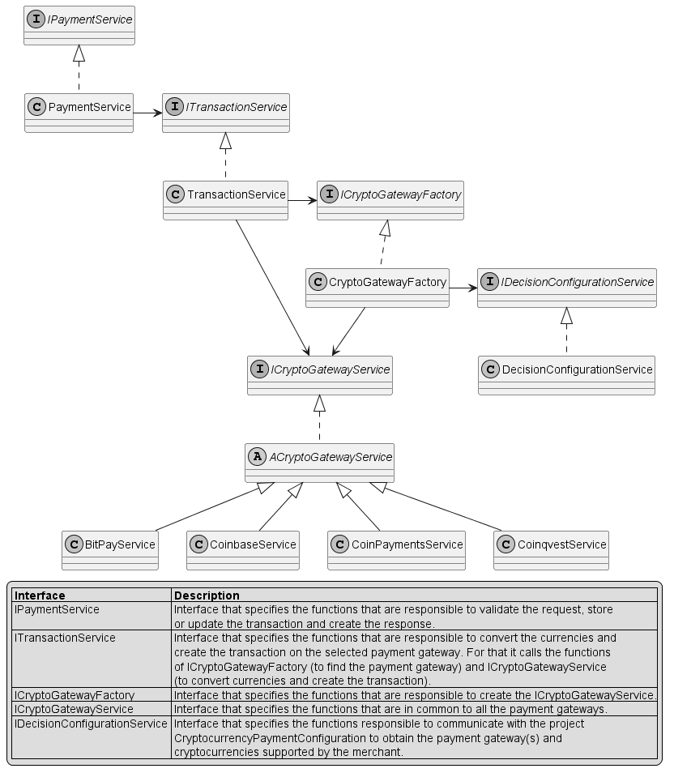|
|:--:|
|*Services created to handle the conversion of fiat currency to cryptocurrency, presented in a UML Class Diagram*|

After getting the list of payment gateways that are accessible and can supposedly convert currencies, the first payment gateway with a valid response to the conversion request is found.

Finally, the Transaction entity is built and stored on DB, with the payment gateway identification and the status "Currency Converted".

The UML Sequence Diagram in following figure 24 depicts, in general, the flow described herein.

|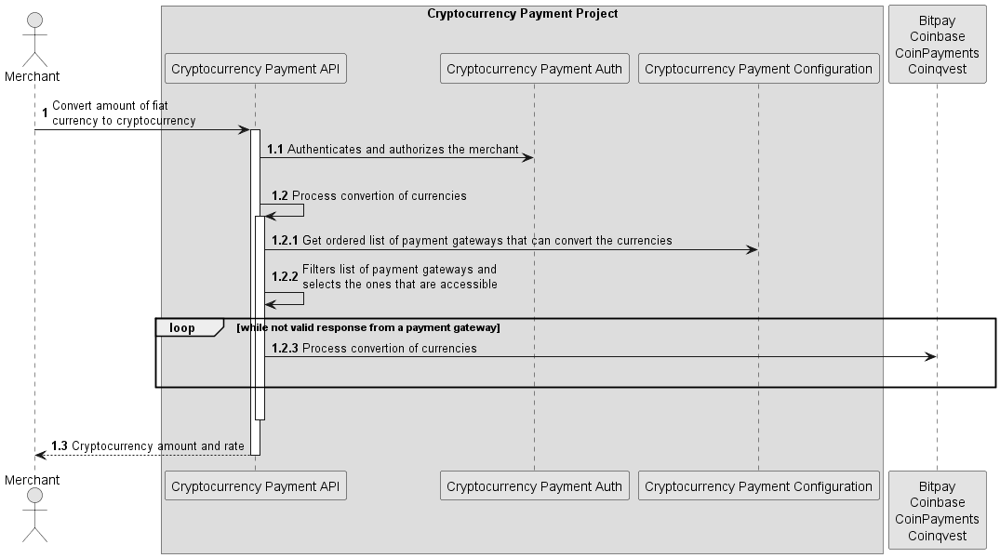|
|:--:|
|*High-level flow of converting fiat currency to cryptocurrency*|

Following figures show in more detail the steps taking place in the `CryptocurrencyPaymentAPI` application.

|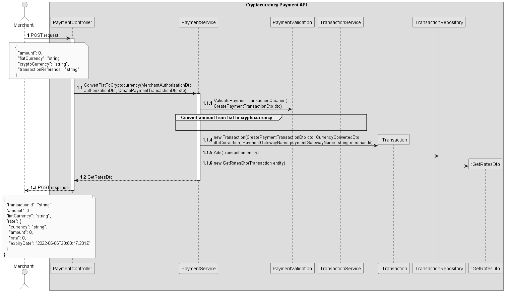|
|:--:|
|*Flow of converting fiat currency to cryptocurrency (with Interaction Use), presented in a UML Sequence Diagram*|

|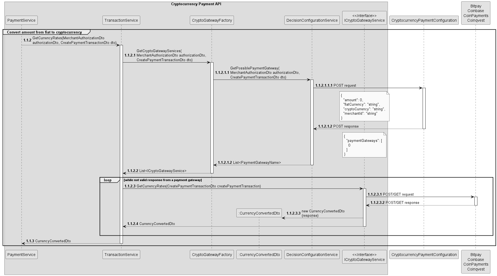|
|:--:|
|*Flow of converting fiat currency to cryptocurrency (Interaction Use part), presented in a UML Sequence Diagram*|

#### UC3: Create payment transaction
This use case is simpler since one already knows which cryptocurrency payment gateway to use to process the transaction. The merchant authentication and authorization are performed. Next, the transaction previously stored in the database is retrieved, using the transaction identifier provided in the HTTP request.

It is checked whether this transaction was initiated by the merchant placing the request. Also is validated that the Transaction status is "Currency Converted" and that the conversion rate did not expire. If at least one of those validations is not verified, the request ends herein with an error.

The cryptocurrency payment gateway is called to provide the payment data, which can be either the wallet address or the QR Code URL, depending on the payment gateway. Finally, the transaction is updated in the database with the new data received and the status “Initialized”. Finally, the response is returned to the client.

#### UC4: Process transaction
UML Sequence Diagram presented in section [Detailed Design](#Detailed-Design) exhibits that the cryptocurrency payment gateways are responsible for notifying the Cryptocurrency Payment Application of the transaction completion. Here the concept of Webhook is introduced since the communication is initiated by the application providing the information. The CryptocurrencyPaymentAPI will receive an HTTP POST request from the cryptocurrency payment gateways once they have data about the transaction.

CryptocurrencyPaymentAPI must give the cryptocurrency payment gateway the URL to which it must deliver the requests. Depending on the cryptocurrency payment gateway was accomplished on UC2 or UC3.

Also was necessary to implement the controller responsible for receiving these POST requests. Consequently, was defined an endpoint for each cryptocurrency payment gateway that the CryptocurrencyPaymentAPI is integrating.

Each cryptocurrency payment gateway provides a different structure for the Webhook, so its handling is distinct. Nevertheless, the data is interpreted and mapped to mutual fields and values. For this reason, the process is as seamless as possible for the merchant.

The transaction is updated in the database with the new data and the status "Transmitted" or "Failed". The latter happens whenever the transaction is not completed successfully. For example, a transaction timeout can ensue when the client exceeds the time to pay the transaction.

#### UC5: List transaction by identifier
After authentication and authorization of the merchant, the transaction is retrieved from the database using the identifier provided by the merchant. The transaction is then validated.

Particularly is verified that the transaction exists and was initiated by the merchant.

## Solution Assessment
The evaluation of the software solution followed the Goal/Question/Metric (GQM) approach.

Following table depicts the goals, questions, and metrics, and in this case, the aim is defined accordingly to some quality attributes with which the solution must comply.

| Quality attribute   | Goal                                                                      | Question                                                                 | Metric                                                                                            |
|---------------------|---------------------------------------------------------------------------|--------------------------------------------------------------------------|---------------------------------------------------------------------------------------------------|
| QA1 Maintainability | G1 Analyse the solution to understand the maintainability and its causes. | Q1 What is the technical debt ratio value at the end of the project?     | M1 Technical Debt Ratio (technical debt divided by the estimated cost to rewrite the application) |
|                     |                                                                           | Q2 How many code smells exist at the end of the project?                 | M2 Number of code smells                                                                          |
| QA2 Security        | G2 Analyse the solution to understand the security and its causes.        | Q3 How many vulnerabilities exist at the end of the project?             | M3 Number of vulnerabilities                                                                      |
|                     |                                                                           | Q4 What is the distribution of vulnerabilities over security categories? | M4 Number of informational, low, medium, and high vulnerabilities                                 |
| QA3 Reliability     | G3 Analyse the solution to understand the reliability and its causes.     | Q5 How many bugs exist at the end of the project?                        | M5 Number of bugs                                                                                 |
|                     |                                                                           | Q6 What is the distribution of bugs over reliability categories?         | M6 Number of minor, major, critical and blocker bugs                                              |

With the goals, questions and metrics defined, one can specify the expected results of the assessment:
1. The technical debt ratio is less than 5.0% (M1);
2. There are no more than 30 code smells (M2);
3. The system does not have any vulnerability (M3 and M4);
4. The system does not have any bugs (M5 and M6).

Automatic and digitized tools, such as Sonarqube, Snyk and Acunetix, were used during the development of the solution and in this phase to acquire accurate measurements.

### SonarQube
SonarQube is an open-source platform developed to perform automatic reviews with static analysis of the code to detect bugs, code smells and security vulnerabilities.

This tool was used to evaluate the quality attributes of Maintainability, Security, and Reliability:

1. The technical debt ratio is 0.0% (M1);
2. The number of code smells is 23 (M2);
3. Number of vulnerabilities is 0 (M3);
4. Number of bugs is 0 (M5)

Following figures display the complete SonarQube result’s analysis regarding the quality attributes.

|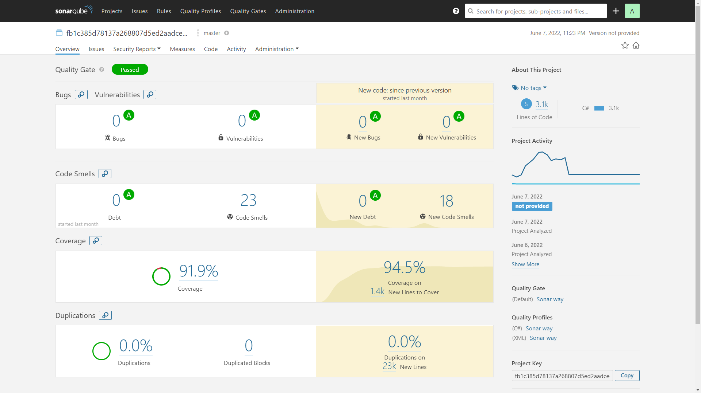|
|:--:|
|*Overview of SonarQube analysis results*|

|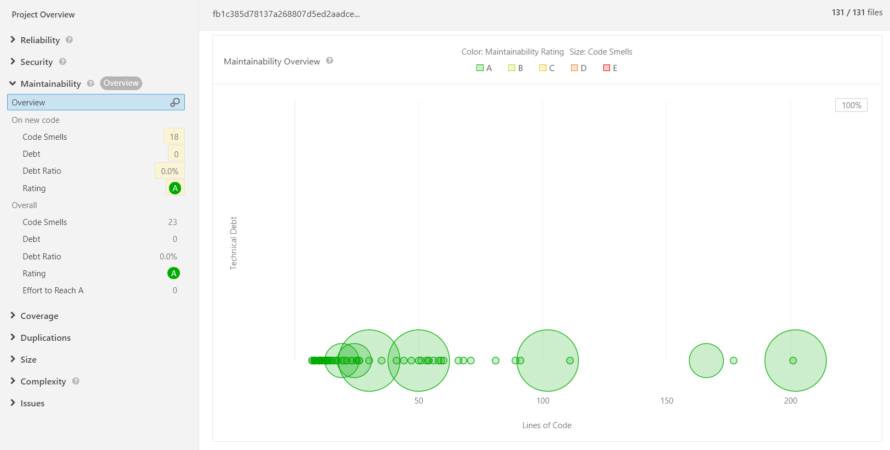|
|:--:|
|*Summary of maintainability rating of SonarQube analysis results*|

|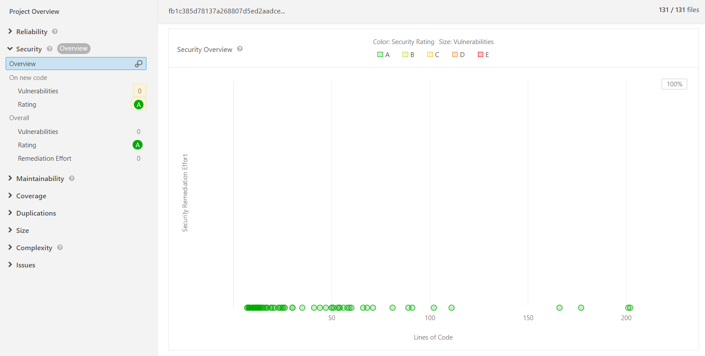|
|:--:|
|*Summary of security rating of SonarQube analysis results*|

|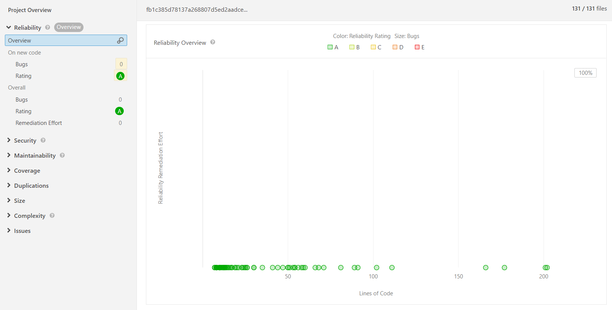|
|:--:|
|*Overview of reliability rating of SonarQube analysis results*|

### Snyk
Snyk is a developer security platform to find and automatically fix vulnerabilities. This tool was used to detect disclosed vulnerabilities in the source code and both the direct and in-direct (transitive) open-source dependencies. The following figure reveals that this tool did not find any vulnerability (M3).

|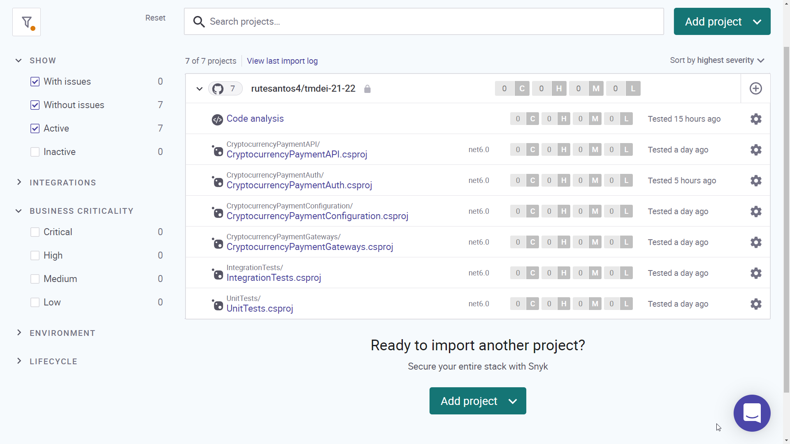|
|:--:|
|*Overview of Snyk analysis results*|

### Acunetix
Acunetix is a security scanner tool designed to replicate techniques used by attackers. It performs automated and manual penetration tests to find publicly disclosed vulnerabilities, such as SQL or command injections, OWASP Top 10, Sensitive Data Exposure, and Cross-Site Scripting (XSS). The following figure reveals that this tool did not find any vulnerability (M3).

|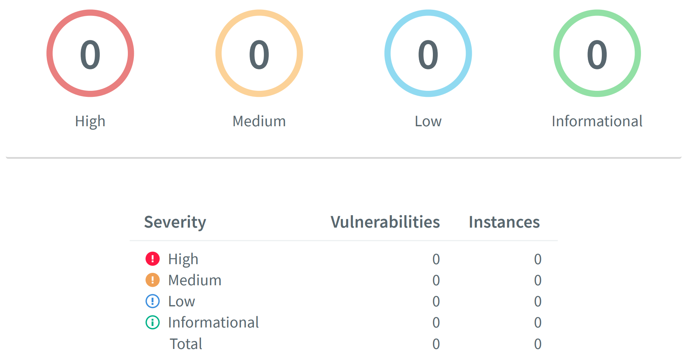|
|:--:|
|*Overview of Acunetix analysis results*|

### Conclusion of the assessment goals

The following table presents the questions’ answers and the conclusions made in terms of metrics
results.

| Goal | Conclusions
|:--|:--|
| G1 Analyse the solution to understand the maintainability and its causes.	|Q1 Q2 The final prototype has a technical debt ratio of 0.0%, which is less than the expected result (5.0%), and 23 code smells, which is less than the limit established (30). In summary, the solution fulfils the requirements of the maintainability quality attribute, even though there is scope for improvement to minimize the number of code smells.
| G2 Analyse the solution to understand the security and its causes.		|Q3 Q4 All the vulnerabilities found were fixed during the development of the solution, finishing with an application free of security weaknesses. This goal is a crucial one since the solution is a payment application. A lot of effort was put into the security analysis of the application, where various tools were used to scan the application's security. Besides was possible to find, understand, and fix some vulnerabilities.
| G3 Analyse the solution to understand the reliability and its causes.		|Q5 Q6 The application does not have any bugs. The solution can be considered reliable because there are no bugs that can lead to an error or unexpected behaviour at runtime.

Although the final solution attained the expected result, some factors were identified which may have an undue influence on the development or distort the data collected. These raise questions about the validity of the solution in other environments or operation systems:

- All applications were running on the same machine during testing and validation. Although it should work the same way in different machines and operating systems, this project did not validate it.
- This project focused on using four cryptocurrency payment gateways, which were mocked up. So, this project has not tested or validated the integration with the cryptocurrency payment gateways, and this research cannot be used to claim this.
- At the time of validation, no disclosed vulnerabilities were found in the open-source dependencies, which does not mean that vulnerabilities are not found in them later.

## Limitations and Future Work

Despite the successful implementation and positive evaluation of the developed system, some limitations and tasks that aim to improve the presented solution have been identified.

The developed solution processes cryptocurrency transactions through integration with cryptocurrency payment gateways. The major limitation of the project is that these services were mocked, and consequently, the integration was simulated. The choice of cryptocurrency payment gateway with a free trial was not a selection factor since the trial time would not be enough to complete the project. In the future will be essential to do and tests the integration
with the right services.

It would be interesting for the decision of the cryptocurrency payment gateway to process the transaction to be configurable, although it was not the project's primary focus. At the moment, this choice is the same for all traders, the deciding factor being the currencies of the transaction. A possible future work would be to make this choice configurable by the merchant based on more criteria that might make sense. The existence of an application already dedicated to this effect makes its evolution easier without changing or jeopardizing the existing behaviour of the CryptocurrencyPaymentAPI application.

Another point of improvement would be the activity logs, which were considered during the implementation of the application. However, store these logs in a database would be an asset. This change would make the application more advantageous for merchants, as they could track transactions and, perhaps, generate reports. This topic would need more research to respect the security quality attribute.

A solution was implemented to avoid errors still exceptions were created to control the flow of orders. It would be interesting to change this part of the code to use monads. Result/error monads would create a wrapper of the function result defining the success and failure path removing the need to define exceptions. This work was not executed due to a lack of experience with this concept, which would have compromised the implementation’s completion.

Lastly, an attractive perspective for evaluating the solution would be to perform performance tests. The performance quality attribute was not a requirement raised and therefore was not evaluated. However, transaction time is a valuable factor in financial transactions.
